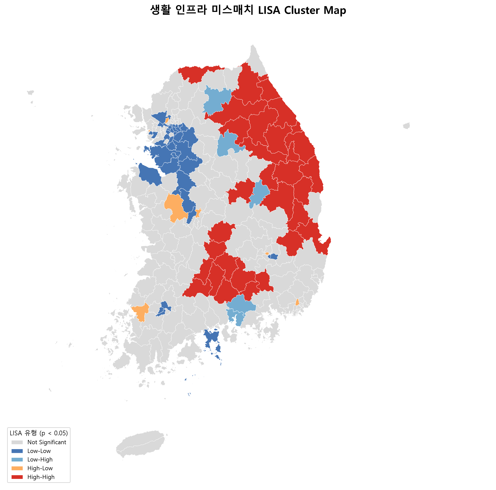
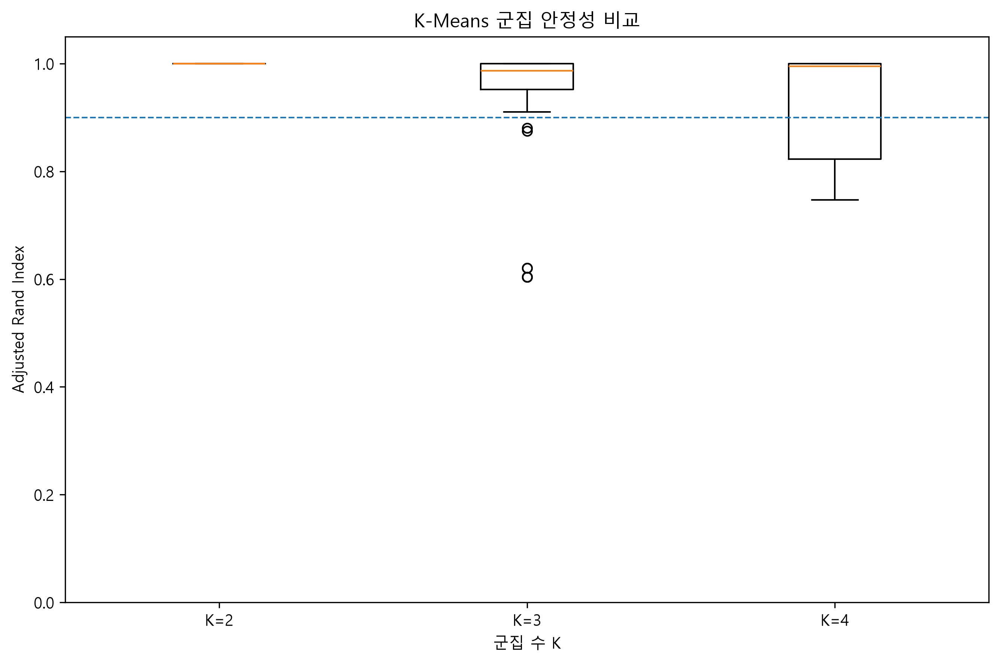
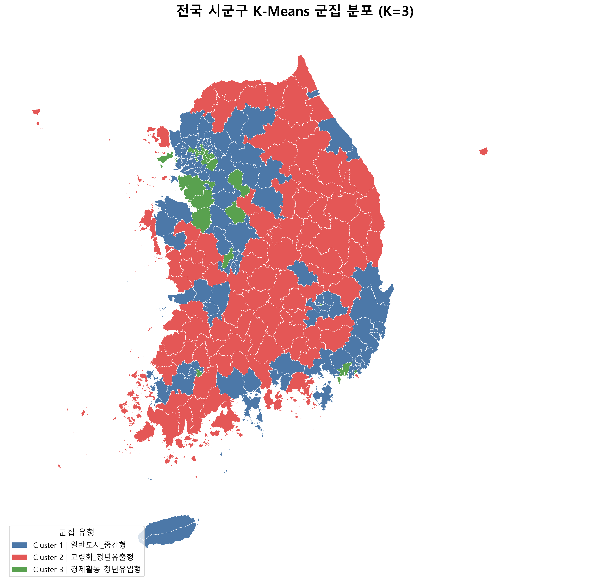
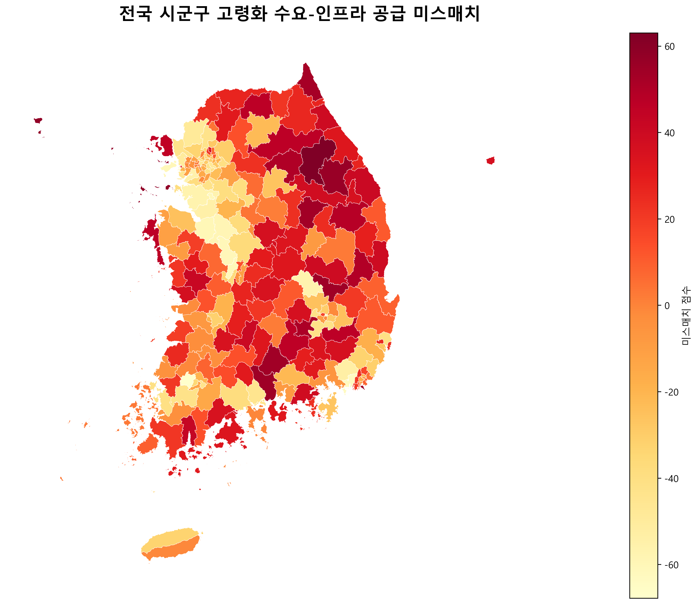
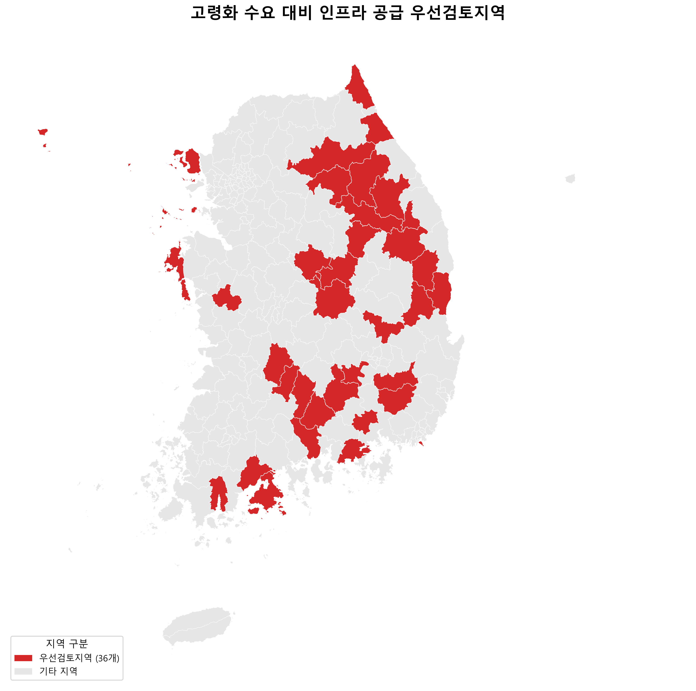

# AGING IMPACT

## 지역별 고령화 충격과 생활 인프라 미스매치 분석

지역별 고령화 수준과 인구 변화, 청년 이동, 경제활동, 생활 인프라 데이터를 결합하여  
고령화가 빠르게 진행되는 지역에서 나타나는 구조적 변화와 생활 인프라의 불균형을 분석하는 프로젝트입니다.

---

## 프로젝트 목표

본 프로젝트에서는 다음 질문을 중심으로 분석합니다.

- 고령화가 빠르게 진행되는 지역은 어디인가?
- 고령화 지역에서 청년 순유출과 인구 감소가 함께 나타나는가?
- 지역의 경제활동 수준은 고령화 및 인구 변화와 어떤 관계가 있는가?
- 고령화 수준에 비해 의료·복지·교통 인프라가 부족한 지역은 어디인가?
- 여러 지표를 종합했을 때 지역은 어떤 유형으로 구분되는가?
- 생활 인프라 미스매치가 공간적으로 무작위하게 분포하는가?
- 높은 미스매치 지역이 주변 지역과 함께 공간적으로 군집되는가?
- K-Means 군집 결과는 초기값 변화에도 안정적으로 재현되는가?

---

## 데이터 구성

### A 담당 - 인구·이동·경제 데이터

A 담당에서는 다음 데이터를 처리했습니다.

- 주민등록인구
- 청년인구
- 고령인구
- 청년 전입 / 전출 / 순이동
- 사업체수
- 종사자수

주요 분석 기간:

```text
인구 / 이동: 2016~2025
경제 데이터: 2024
```

### B 담당 - 생활 인프라 데이터

B 담당에서는 다음 데이터를 처리했습니다.

- 병원
- 약국
- 노인복지시설
- 버스정류장
- 도시철도 역사
- 시군구 행정경계

주요 데이터 기준:

```text
병원 / 약국: 2025-12-31
노인복지시설: 2025-12-31
버스정류장: 2025-10-31
도시철도 역사: 2026-06-30
행정경계: 2025년 2분기
```

도시철도 데이터는 분석에 적합한 2025년 기준 전국 통합 자료를 찾지 못해 2026-06-30 기준 자료를 사용했습니다.

---

## 분석 단위

A와 B 데이터의 최종 분석 단위는 동일한 **229개 시군구급 지역, 17개 시도**로 통일했습니다.

```text
229개 시군구급 지역
17개 시도
```

A 데이터에서는 행정구역 변경이 발생한 지역을 현재 분석 기준에 맞게 지역코드를 정리했습니다.

대표 사례:

```text
인천 남구 28170
→ 미추홀구 28177

경북 군위군 47720
→ 대구 군위군 27720
```

B 데이터에서는 원자료별로 서로 다른 시군구 표기를 A 데이터와 결합할 수 있도록 동일한 지역 단위로 표준화했습니다.

일반시의 행정구는 상위 시 단위로 통합했습니다.

대표 사례:

```text
수원시 장안구 → 수원시
고양시 덕양구 → 고양시
청주시 흥덕구 → 청주시
전주시 완산구 → 전주시
창원시 성산구 → 창원시
```

세종특별자치시는 분석 기준에 맞춰 동일한 지역명 체계로 통일했습니다.

최종 A·B 결합 결과:

```text
A 분석지역: 229개
B 분석지역: 229개
최종 매칭: 229 / 229
```

---

## 주요 분석 지표

### A - 인구·이동·경제 지표

주요 파생지표:

```text
고령화율_2025
고령화율변화폭_2016_2025

청년비율_2025
청년비율변화폭_2016_2025

인구증감률_2016_2025
청년순이동률_2016_2025

인구천명당_사업체수_2024
인구천명당_종사자수_2024
사업체당_종사자수_2024
```

### B - 생활 인프라 지표

B 데이터에서는 지역별 시설 수와 함께 65세 이상 인구를 기준으로 생활 인프라 공급 수준을 비교하기 위한 지표를 생성했습니다.

```text
노인천명당_병원수
노인천명당_약국수
노인천명당_복지시설수
노인천명당_버스정류장수
노인천명당_철도역수
```

계산식:

```text
시설 수 / 65세 이상 인구 × 1,000
```

---

## B 생활 인프라 전처리 결과

### 의료 인프라

건강보험심사평가원 요양기관 개설 현황을 활용했습니다.

병원은 다음 요양종별을 포함했습니다.

- 상급종합병원
- 종합병원
- 병원
- 요양병원
- 정신병원

약국은 별도로 집계했습니다.

```text
병원: 3,380개
약국: 25,497개
```

### 노인복지 인프라

다음 6개 시설 유형을 분석에 사용했습니다.

- 노인주거복지시설
- 노인의료복지시설
- 노인여가복지시설
- 재가노인복지시설
- 노인일자리지원기관
- 학대피해노인 전용쉼터

6개 유형을 합산하여 `노인복지시설수`를 생성했습니다.

```text
노인복지시설수: 97,193개
```

치매전담형 장기요양기관은 다른 시설 유형과의 중복 가능성을 고려하여 합계에서 제외했습니다.

### 버스정류장

전국 버스정류장 위치정보의 위·경도 좌표와 2025년 2분기 시군구 행정경계를 공간 결합하여 행정구역을 표준화했습니다.

```text
원본 정류장: 227,065개
좌표 존재: 227,060개
공간 매칭 성공: 227,004개
제외: 61개
```

좌표 결측 또는 행정경계와 매칭되지 않은 정류장은 분석에서 제외했습니다.

선택한 원자료에서 강원 고성군의 버스정류장 자료가 확인되지 않아 원본 데이터에서는 결측값으로 유지했습니다.

최종 군집분석 및 미스매치 분석 단계에서는 해당 결측값을 0으로 처리하지 않고 **강원 지역 버스정류장 지표 중앙값**으로 보완했습니다.

### 도시철도

도시철도 원자료는 동일 역사가 노선별로 중복될 수 있어 `시도명 + 시군구명 + 역사명`을 기준으로 중복을 제거했습니다.

```text
원본: 1,099행
중복 제거: 99행
최종 도시철도 역사: 1,000개
```

도시철도 역사가 존재하지 않는 지역은 0으로 처리했습니다.

---

## 탐색적 분석 결과

A+B 통합 EDA에서 주요 변수 간 관계를 확인했습니다.

### 인구증감률 ↔ 청년순이동률

```text
r = 0.901
```

청년 순유입이 많은 지역일수록 전체 인구도 증가하는 강한 경향이 나타났습니다.

### 고령화율 ↔ 청년비율

```text
r = -0.877
```

고령화율이 높은 지역일수록 청년 비율이 낮은 경향이 나타났습니다.

### 고령화율 변화폭 ↔ 청년순이동률

```text
r = -0.789
```

고령화가 빠르게 진행된 지역일수록 청년 순유출이 함께 나타나는 경향이 확인되었습니다.

### 고령화율 ↔ 노인천명당 복지시설수

```text
r = 0.761
```

고령화율이 높은 지역에서 노인 인구 대비 복지시설 공급 수준이 높은 경향이 나타났습니다.

### 고령화율 ↔ 노인천명당 약국수

```text
r = -0.651
```

고령화율이 높은 지역일수록 노인 인구 대비 약국 공급 수준은 낮아지는 경향이 확인되었습니다.

상관관계는 인과관계를 의미하지 않습니다.

---

## 최종 분석 변수 선정

높은 상관관계로 인해 중복 정보가 큰 변수를 일부 제외했습니다.

주요 제외 사례:

```text
고령화율_2025 ↔ 청년비율_2025
r = -0.877

인구증감률_2016_2025 ↔ 청년순이동률_2016_2025
r = 0.901

인구천명당_사업체수_2024 ↔ 인구천명당_종사자수_2024
r = 0.837
```

최종 군집분석 변수:

```text
고령화율_2025
고령화율변화폭_2016_2025
청년비율변화폭_2016_2025
청년순이동률_2016_2025

인구천명당_종사자수_2024
사업체당_종사자수_2024

노인천명당_병원수
노인천명당_약국수
노인천명당_복지시설수
노인천명당_버스정류장수
노인천명당_철도역수
```

총 11개 변수를 최종 군집분석에 사용했습니다.

---

## K-Means 전처리

거리 기반 군집분석에서 분포 왜도가 큰 변수의 영향을 줄이기 위해 절대 왜도 1 이상인 변수에 Yeo-Johnson 변환을 적용했습니다.

변환 대상:

```text
청년순이동률_2016_2025
인구천명당_종사자수_2024
사업체당_종사자수_2024
노인천명당_병원수
노인천명당_약국수
노인천명당_철도역수
```

이후 모든 최종 분석 변수에 `StandardScaler`를 적용했습니다.

---

## K-Means 군집분석

K=2~8에 대해 Inertia와 Silhouette Score를 비교했습니다.

주요 결과:

```text
K=2  Silhouette = 0.3255
K=3  Silhouette = 0.2701
K=4  Silhouette = 0.2418
```

Silhouette Score만 보면 K=2가 가장 높았으나, 실제 지역 특성 해석력과 프로젝트 목적을 함께 고려하여 **최종 K=3**으로 선정했습니다.

K=3은 일반적인 중간형 지역 외에 고령화·청년유출 지역과 경제활동·청년유입 지역을 별도의 유형으로 구분할 수 있다는 점을 고려했습니다.

최종 군집:

| Cluster | 유형 | 지역 수 |
|---|---|---:|
| 1 | 일반도시_중간형 | 113 |
| 2 | 고령화_청년유출형 | 91 |
| 3 | 경제활동_청년유입형 | 25 |

### Cluster 1 - 일반도시_중간형

- 상대적으로 낮은 고령화 수준
- 청년 이동과 경제활동이 중간 수준
- 생활 인프라 공급 수준도 전반적으로 중간 수준

### Cluster 2 - 고령화_청년유출형

- 가장 높은 고령화율과 고령화 진행 속도
- 큰 청년 순유출
- 약국·철도 공급 수준은 낮은 편
- 복지시설·버스정류장 공급은 상대적으로 높은 편

### Cluster 3 - 경제활동_청년유입형

- 가장 낮은 고령화 수준
- 청년 순유입
- 높은 종사자수 및 사업체당 종사자수
- 약국·철도 공급 수준도 높은 편

---

## 생활 인프라 미스매치 분석

고령화 수요와 생활 인프라 공급 수준을 백분위 점수로 비교했습니다.

### 고령화 수요 점수

```text
고령화 수요 점수
=
고령화율 백분위
+
고령화율 변화폭 백분위
의 평균
```

### 생활 인프라 공급 점수

```text
생활 인프라 공급 점수
=
병원
+
약국
+
복지시설
+
버스정류장
+
철도역
백분위의 평균
```

### 미스매치 점수

```text
미스매치 점수
=
고령화 수요 점수
-
생활 인프라 공급 점수
```

`미스매치점수_100`은 위 차이에 100을 곱한 **signed score**입니다.

```text
양수 ↑
→ 고령화 수요 대비 인프라 공급이 상대적으로 부족한 방향

0 근처
→ 고령화 수요와 인프라 공급 수준이 유사

음수 ↓
→ 고령화 수요 대비 인프라 공급이 상대적으로 충분한 방향
```

따라서 `미스매치점수_100`은 0~100 범위의 정규화 점수가 아닙니다.

---

## 우선 검토 지역

다음 기준을 동시에 만족하는 지역을 우선 검토 지역으로 정의했습니다.

```text
고령화 수요 점수 상위 25%
+
인프라 공급 점수 하위 50%
```

결과:

```text
우선 검토 지역: 36개
```

전체 미스매치 상위 20개 지역은 모두 `고령화_청년유출형` 군집에 포함되었습니다.

대표 상위 지역:

```text
1위  강원 평창군
2위  인천 옹진군
3위  강원 정선군
4위  부산 영도구
5위  대구 군위군
```

---

## 민감도 분석

미스매치 결과가 특정 인프라 가중치 설정에 과도하게 의존하는지 확인하기 위해 4개 시나리오를 비교했습니다.

```text
균등가중치
병원 20 / 약국 20 / 복지 20 / 버스 20 / 철도 20

의료 강조
병원 30 / 약국 30 / 복지 20 / 버스 10 / 철도 10

교통 강조
병원 15 / 약국 15 / 복지 20 / 버스 25 / 철도 25

철도 영향 축소
병원 25 / 약국 25 / 복지 25 / 버스 20 / 철도 5
```

균등가중치 대비 Spearman 순위 상관계수:

```text
의료 강조       0.9920
교통 강조       0.9968
철도 영향 축소   0.9903
```

균등가중치 Top20과의 중복률:

```text
의료 강조       90%
교통 강조      100%
철도 영향 축소   95%
```

4개 시나리오 모두에서 Top20에 포함된 지역은 **18개**였습니다.

안정적으로 반복 확인된 지역:

```text
강원 평창군
인천 옹진군
대구 군위군
강원 정선군
부산 영도구
충북 단양군
경남 하동군
경남 산청군
강원 고성군
경북 고령군
강원 횡성군
경북 청송군
경북 봉화군
충남 태안군
강원 홍천군
강원 화천군
인천 강화군
경남 합천군
```

이를 통해 인프라 가중치를 변경하더라도 주요 미스매치 지역의 순위가 높은 수준으로 유지되는 것을 확인했습니다.

---

## 공간 통계 분석

생활 인프라 미스매치 점수가 공간적으로 무작위하게 분포하는지 확인하기 위해 Global Moran’s I와 Local Moran’s I(LISA)를 적용했습니다.

### 공간 가중치 구성

공간 가중치는 기본적으로 **Queen Contiguity**를 사용했습니다.

Queen Contiguity는 행정구역의 경계 또는 꼭짓점이 맞닿은 지역을 서로 이웃으로 정의합니다.

다만 도서 지역 등 경계가 직접 맞닿지 않아 이웃이 없는 지역은 중심점 기준 최근접 지역 1개를 연결하여 공간 가중치를 보완했습니다.

```text
기존 Queen 기준 island: 8개
보정 후 island: 0개
```

최근접 이웃 보완 대상:

```text
경남 거제시 → 경남 통영시
경남 남해군 → 경남 사천시
경북 울릉군 → 경북 울진군
부산 영도구 → 부산 중구
인천 강화군 → 경기 김포시
인천 옹진군 → 인천 강화군
전남 완도군 → 전남 강진군
전남 진도군 → 전남 해남군
```

보정 후 모든 229개 지역이 최소 1개 이상의 공간 이웃을 가지도록 구성했습니다.

### Global Moran’s I

미스매치 점수의 전역 공간 자기상관을 확인했습니다.

```text
Moran's I = 0.4039
Expected I = -0.0044
Permutation p-value = 0.0001
z-score = 9.1570
```

Moran’s I가 양수이고 9,999회 permutation 검정에서도 통계적으로 유의하게 나타나, 미스매치 점수가 전국에 무작위하게 분포하기보다는 **유사한 수준의 지역끼리 공간적으로 인접해 나타나는 양의 공간 자기상관**을 확인했습니다.

### Local Moran’s I (LISA)

지역별 공간 군집 유형을 확인하기 위해 Local Moran’s I를 적용했습니다.

```text
High-High          32개
Low-Low            37개
High-Low            7개
Low-High             5개
Not Significant    148개
```

각 유형은 다음과 같이 해석했습니다.

```text
High-High
→ 높은 미스매치 지역 주변에도 높은 지역이 위치

Low-Low
→ 낮은 미스매치 지역 주변에도 낮은 지역이 위치

High-Low
→ 높은 미스매치 지역이 낮은 지역들 사이에 위치

Low-High
→ 낮은 미스매치 지역이 높은 지역들 사이에 위치
```

대표 High-High 지역:

```text
강원 평창군
강원 정선군
경남 산청군
강원 횡성군
경북 청송군
경북 봉화군
강원 홍천군
경남 합천군
전북 장수군
강원 삼척시
```

High-High 32개 지역 중 대부분이 `고령화_청년유출형` 군집에 포함되어, 기존 K-Means 군집분석과 공간 통계 분석에서 일관된 지역 패턴을 확인했습니다.

### LISA Cluster Map



---

## K-Means 군집 안정성 검증

K-Means는 초기 중심점 설정에 따라 군집 결과가 달라질 수 있으므로, 최종 군집 수 선택의 안정성을 확인하기 위해 반복 군집화를 수행했습니다.

K=2, K=3, K=4에 대해 `random_state`를 100회 변경하여 군집 결과를 비교했습니다.

```text
분석 지역: 229개
분석 변수: 11개
반복 횟수: 100회
기준 random_state: 42
n_init: 20
평가 지표: Adjusted Rand Index (ARI)
```

ARI는 두 군집 결과의 구성 유사도를 비교하는 지표로, 군집 번호 자체가 서로 달라도 동일한 지역 구성이면 높은 값을 가집니다.

### 기준 군집 대비 ARI

```text
K=2
평균 ARI: 1.0000
최소 ARI: 1.0000
ARI >= 0.9 비율: 100%

K=3
평균 ARI: 0.9563
중앙값 ARI: 0.9865
최소 ARI: 0.6037
ARI >= 0.9 비율: 93%

K=4
평균 ARI: 0.9342
중앙값 ARI: 0.9954
최소 ARI: 0.7468
ARI >= 0.9 비율: 73%
```

### Seed 간 Pairwise ARI

기준 seed와의 비교뿐만 아니라 100개 random seed의 모든 조합에 대해 Pairwise ARI를 추가로 계산했습니다.

```text
K=2
Pairwise 평균 ARI: 1.0000
Pairwise 중앙값 ARI: 1.0000
ARI >= 0.9 비율: 100.0%

K=3
Pairwise 평균 ARI: 0.9316
Pairwise 중앙값 ARI: 0.9565
ARI >= 0.9 비율: 88.1%

K=4
Pairwise 평균 ARI: 0.9019
Pairwise 중앙값 ARI: 0.9454
ARI >= 0.9 비율: 60.0%
```

K=2가 가장 높은 안정성을 보였으나 지역 특성을 두 집단으로 단순화하는 한계가 있었습니다.

반면 K=3은 높은 군집 안정성을 유지하면서 `일반도시_중간형`, `고령화_청년유출형`, `경제활동_청년유입형`을 구분할 수 있었습니다.

따라서 Silhouette Score, 군집 해석 가능성, 반복 군집화 안정성을 함께 고려하여 **K=3을 최종 군집 수로 유지**했습니다.

### 군집 안정성 시각화



---

## 시각화

최종 시각화는 생활 인프라 비교, 지역 유형, 미스매치, 공간 통계 결과로 구성했습니다.

### 생활 인프라 시각화

```text
results/visualization/infrastructure/
```

포함 결과:

- 노인 1,000명당 병원 상·하위 지역
- 노인 1,000명당 약국 상·하위 지역
- 노인 1,000명당 복지시설 상·하위 지역
- 노인 1,000명당 버스정류장 상·하위 지역
- 철도 보유 및 상위 지역
- 고령화율 ↔ 약국 산점도
- 고령화율 ↔ 복지시설 산점도
- 고령화율 ↔ 철도역 산점도

### K=3 군집 지도



### 미스매치 점수 지도



### 우선 검토 지역 지도



### LISA 공간 군집 지도


지도 시각화와 공간 통계 분석에는 SGIS 2025년 2분기 시군구 행정경계를 사용했습니다.

원본 252개 경계를 분석 기준에 맞게 통합하여 최종 **229개 분석지역과 229/229 매칭**을 확인했습니다.

※ 행정경계 Shapefile은 파일 용량으로 인해 GitHub 저장소에 포함하지 않았습니다.

---

## 핵심 분석 결과

최종적으로 다음과 같은 결과를 확인했습니다.

- 고령화가 빠르게 진행되는 지역일수록 청년 순유출이 크게 나타나는 경향 확인
- 고령화·청년유출형 군집에서 생활 인프라 미스매치가 상대적으로 크게 나타남
- 미스매치 상위 20개 지역이 모두 고령화·청년유출형 군집에 포함
- 고령지역이라도 모든 인프라가 동일하게 부족한 것은 아니며, 복지시설·버스정류장과 의료·철도 인프라 사이의 공급 구조 차이 확인
- 고령화 수요 상위 25%이면서 인프라 공급 하위 50%인 우선 검토 지역 36개 도출
- 4개 가중치 시나리오 모두에서 반복 확인된 안정적 핵심 미스매치 지역 18개 도출
- 민감도 분석에서 최소 Spearman 순위 상관계수 0.9903, Top20 최소 중복률 90% 확인
- Global Moran’s I = 0.4039, p = 0.0001로 미스매치 점수의 유의한 양의 공간 자기상관 확인
- LISA 분석에서 High-High 32개, Low-Low 37개 지역 확인
- High-High 지역은 대부분 고령화·청년유출형 군집에서 나타나 지역 유형과 공간적 미스매치 군집 간 연결 확인
- K=3은 100회 반복 분석에서 기준 군집 대비 평균 ARI 0.9563, ARI 0.9 이상 비율 93% 확인
- K=3의 Seed 간 Pairwise ARI도 평균 0.9316으로 나타나 초기화 변화에도 높은 군집 재현성 확인

---

## 해석상 주의사항

- 상관관계는 인과관계를 의미하지 않습니다.
- 생활 인프라 지표는 65세 이상 인구를 분모로 사용하므로 변수 간 관계 해석 시 분모 구조의 영향을 고려해야 합니다.
- 미스매치 점수는 229개 분석지역 내 상대적 비교를 위한 지표입니다.
- `미스매치점수_100`은 0~100 범위의 절대 점수가 아닌 signed score입니다.
- 본 결과를 절대적인 지역 취약성 판정 기준으로 사용할 수 없습니다.
- 우선 검토 지역 36개는 분석 목적에 따라 설정한 상대적 기준으로, 공식적인 취약지역 지정 기준이 아닙니다.
- 생활 인프라 지표는 시설 수를 기반으로 하므로 실제 이동시간, 접근성, 서비스 품질, 시설 규모 등은 직접 반영하지 않습니다.
- 철도역이 없는 지역이 많아 철도 지표의 분포가 비대칭적일 수 있습니다.
- 강원 고성군 버스정류장 값은 원자료 부재로 원본에서는 결측값으로 유지했으며, 군집 및 미스매치 분석 단계에서 강원 지역 중앙값으로 보완했습니다.
- Moran’s I와 LISA 결과는 사용한 공간 가중치 구조에 영향을 받을 수 있습니다.
- 공간 통계 분석에서는 Queen Contiguity를 기본으로 하고 이웃이 없는 도서 지역만 중심점 기준 최근접 이웃으로 보완했습니다.
- LISA의 High-High는 절대적으로 미스매치 점수가 가장 높은 지역을 의미하는 것이 아니라, 주변 지역과 함께 상대적으로 높은 값이 공간적으로 군집된 지역을 의미합니다.
- 군집 안정성 검증은 초기 중심점 변화에 대한 안정성을 확인한 것으로, 다른 변수 구성이나 다른 군집 알고리즘에서도 동일한 결과를 보장하는 것은 아닙니다.
- PCA 2차원 시각화는 군집 구조를 시각적으로 확인하기 위한 보조 분석이며 전체 변수 정보를 모두 설명하지 않습니다.

---

## 프로젝트 구조

```text
AGING-IMPACT/
│
├─ data/
│  ├─ raw/
│  │  ├─ boundary/
│  │  ├─ business/
│  │  ├─ census_2024/
│  │  ├─ employee/
│  │  ├─ migration/
│  │  ├─ population/
│  │  └─ infrastructure/
│  │
│  └─ processed/
│     ├─ a_dataset_merged.csv
│     ├─ a_dataset_features.csv
│     ├─ medical_by_region.csv
│     ├─ bus_by_region.csv
│     ├─ subway_by_region.csv
│     └─ welfare_by_region.csv
│
├─ docs/
│  ├─ README_A.md
│  ├─ README_B.md
│  ├─ data_dictionary_a.md
│  └─ data_dictionary_b.md
│
├─ results/
│  ├─ a_eda/
│  ├─ a_outliers/
│  ├─ a_sido_summary/
│  ├─ a_feature_selection/
│  ├─ b_infrastructure/
│  ├─ ab_merge/
│  ├─ ab_eda/
│  ├─ final_feature_selection/
│  ├─ kmeans_preparation/
│  ├─ kmeans_comparison/
│  ├─ final_kmeans/
│  ├─ mismatch_analysis/
│  ├─ mismatch_sensitivity/
│  ├─ final_summary/
│  ├─ spatial_analysis/
│  ├─ cluster_stability/
│  └─ visualization/
│     ├─ infrastructure/
│     ├─ cluster_map/
│     └─ mismatch_map/
│
├─ src/
│  ├─ 01_check_raw_data.py
│  ├─ 02_preprocess_a.py
│  ├─ 03_preprocess_population.py
│  ├─ 04_check_population.py
│  ├─ 05_preprocess_migration.py
│  ├─ 06_patch_economy_from_census.py
│  ├─ 07_merge_a_dataset.py
│  ├─ 08_create_a_features.py
│  ├─ 09_eda_a.py
│  ├─ 10_check_a_outliers.py
│  ├─ 11_sido_summary.py
│  ├─ 12_prepare_analysis_dataset.py
│  ├─ 13_medical.py
│  ├─ 14_bus.py
│  ├─ 15_subway.py
│  ├─ 16_welfare.py
│  ├─ 17_merge_b.py
│  ├─ 18_merge_ab.py
│  ├─ 19_eda_ab.py
│  ├─ 20_prepare_final_features.py
│  ├─ 21_preprocess_kmeans.py
│  ├─ 22_compare_kmeans.py
│  ├─ 23_final_kmeans.py
│  ├─ 24_mismatch_analysis.py
│  ├─ 25_mismatch_sensitivity.py
│  ├─ 26_final_summary.py
│  ├─ 27_spatial_autocorrelation.py
│  ├─ 28_cluster_stability.py
│  │
│  └─ visualization/
│     ├─ viz_infrastructure.py
│     ├─ viz_cluster_map.py
│     └─ viz_mismatch_map.py
│
├─ .gitignore
├─ requirements.txt
└─ README.md
```

※ `data/raw/boundary/`의 SGIS Shapefile은 파일 용량으로 인해 GitHub 저장소에 포함하지 않습니다.

---

## 실행 환경

Python 가상환경 사용을 권장합니다.

Windows PowerShell 기준:

```powershell
python -m venv .venv
.\.venv\Scripts\Activate.ps1
python -m pip install -r requirements.txt
```

---

## 실행 순서

### A 데이터 전처리

```powershell
python .\src\01_check_raw_data.py
python .\src\02_preprocess_a.py
python .\src\03_preprocess_population.py
python .\src\04_check_population.py
python .\src\05_preprocess_migration.py
python .\src\06_patch_economy_from_census.py
python .\src\07_merge_a_dataset.py
python .\src\08_create_a_features.py
python .\src\09_eda_a.py
python .\src\10_check_a_outliers.py
python .\src\11_sido_summary.py
python .\src\12_prepare_analysis_dataset.py
```

### B 생활 인프라 전처리

```powershell
python .\src\13_medical.py
python .\src\14_bus.py
python .\src\15_subway.py
python .\src\16_welfare.py
python .\src\17_merge_b.py
```

### A+B 통합 및 최종 분석

```powershell
python .\src\18_merge_ab.py
python .\src\19_eda_ab.py
python .\src\20_prepare_final_features.py
python .\src\21_preprocess_kmeans.py
python .\src\22_compare_kmeans.py
python .\src\23_final_kmeans.py
python .\src\24_mismatch_analysis.py
python .\src\25_mismatch_sensitivity.py
python .\src\26_final_summary.py
python .\src\27_spatial_autocorrelation.py
python .\src\28_cluster_stability.py
```

### 시각화

```powershell
python .\src\visualization\viz_infrastructure.py
python .\src\visualization\viz_cluster_map.py
python .\src\visualization\viz_mismatch_map.py
```

※ `27_spatial_autocorrelation.py` 및 지도 시각화 코드를 재실행하려면 `data/raw/boundary/`에 SGIS 2025년 2분기 시군구 행정경계 Shapefile이 필요합니다.

필요한 Shapefile 구성 예시:

```text
bnd_sigungu_00_2025_2Q.shp
bnd_sigungu_00_2025_2Q.shx
bnd_sigungu_00_2025_2Q.dbf
bnd_sigungu_00_2025_2Q.prj
bnd_sigungu_00_2025_2Q.cpg
```

---

## 주요 산출물

### A+B 통합 데이터

```text
results/ab_merge/ab_dataset.csv
```

### 최종 군집 결과

```text
results/final_kmeans/final_cluster_assignments.csv
results/final_kmeans/cluster_for_visualization.csv
results/final_kmeans/final_cluster_summary.csv
results/final_kmeans/final_cluster_profile.png
```

### 미스매치 분석 결과

```text
results/mismatch_analysis/final_mismatch_analysis.csv
results/mismatch_analysis/priority_mismatch_regions.csv
results/mismatch_analysis/mismatch_for_visualization.csv
```

### 민감도 분석 결과

```text
results/mismatch_sensitivity/stable_mismatch_regions.csv
results/mismatch_sensitivity/scenario_rank_correlations.csv
results/mismatch_sensitivity/top20_overlap.csv
```

### 공간 통계 분석 결과

```text
results/spatial_analysis/01_moran_scatterplot.png
results/spatial_analysis/02_lisa_cluster_map.png
results/spatial_analysis/03_moran_permutation_distribution.png

results/spatial_analysis/lisa_results.csv
results/spatial_analysis/high_high_regions.csv
results/spatial_analysis/island_knn_links.csv
results/spatial_analysis/moran_scatter_data.csv

results/spatial_analysis/spatial_analysis_summary.txt
```

### 군집 안정성 검증 결과

```text
results/cluster_stability/01_ari_stability_boxplot.png
results/cluster_stability/02_mean_ari_by_k.png
results/cluster_stability/03_pairwise_ari_by_k.png

results/cluster_stability/stability_runs.csv
results/cluster_stability/stability_summary_reference.csv
results/cluster_stability/pairwise_ari.csv
results/cluster_stability/stability_summary_pairwise.csv

results/cluster_stability/cluster_stability_summary.txt
```

### 최종 요약

```text
results/final_summary/00_key_results.csv
results/final_summary/03_mismatch_top20.csv
results/final_summary/05_stable_mismatch_regions.csv
results/final_summary/08_final_analysis_dataset.csv
results/final_summary/FINAL_ANALYSIS_SUMMARY.txt
```

### 시각화 결과

```text
results/visualization/infrastructure/
results/visualization/cluster_map/
results/visualization/mismatch_map/
```

---

## 기술 스택

- Python
- Pandas
- NumPy
- Matplotlib
- Scikit-learn
- GeoPandas
- PySAL (`libpysal`, `esda`)
- Folium
- OpenPyXL
- pdfplumber

---

## 진행 상태

### 데이터 구축 및 전처리

- [x] 인구 데이터 수집 및 전처리
- [x] 청년 이동 데이터 수집 및 전처리
- [x] 경제 데이터 수집 및 보완
- [x] 생활 인프라 데이터 수집 및 전처리
- [x] 행정구역 코드 및 지역 단위 정리
- [x] A 데이터 통합
- [x] A 파생변수 생성
- [x] B 생활 인프라 데이터 통합
- [x] 노인 천 명당 생활 인프라 지표 생성
- [x] A·B 데이터 최종 결합

### 탐색 및 분석 준비

- [x] A 데이터 EDA
- [x] 이상치 검증
- [x] 시도별 요약
- [x] A 분석 후보 변수 정리
- [x] A+B 통합 EDA
- [x] 최종 분석 변수 선정
- [x] 결측치 보완
- [x] 왜도 검증 및 Yeo-Johnson 변환
- [x] StandardScaler 적용

### 최종 분석

- [x] K 탐색
- [x] K-Means 군집분석
- [x] 군집 특성 해석
- [x] 생활 인프라 미스매치 분석
- [x] 미스매치 민감도 분석
- [x] Global Moran’s I 공간 자기상관 분석
- [x] Local Moran’s I(LISA) 공간 군집 분석
- [x] 도서 지역 공간 가중치 보완
- [x] K-Means 군집 안정성 검증
- [x] 군집 지도 시각화
- [x] 미스매치 지도 시각화
- [x] 우선 검토 지역 시각화
- [x] LISA 군집 지도 시각화
- [x] 최종 결과 요약

---

## 문서

### A 담당

상세 전처리 및 분석 문서:

```text
docs/README_A.md
```

데이터 사전:

```text
docs/data_dictionary_a.md
```

### B 담당

상세 전처리 및 분석 문서:

```text
docs/README_B.md
```

데이터 사전:

```text
docs/data_dictionary_b.md
```